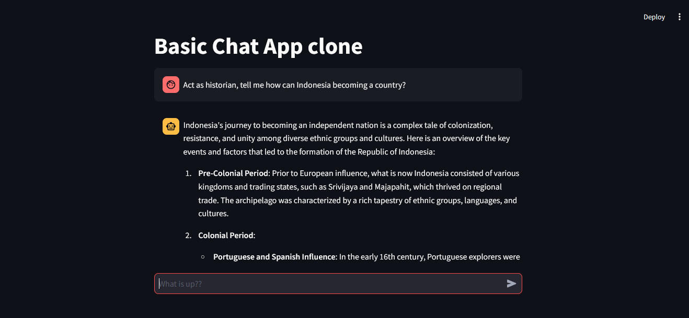

# Basic Chat App Clone

This is a simple web-based application built using **Streamlit** that interacts with OpenAI's API to perform basic chat functionalities. You can input any prompt, and the app will respond using OpenAI's language model.



## Features

- Interactive chat interface that simulates a conversation with an AI assistant.
- Utilizes OpenAI's GPT model for generating responses.
- User-friendly design powered by Streamlit.

## Installation

To run this project locally, follow these steps:

### Prerequisites

Ensure you have the following installed:

- Python 3.x
- OpenAI API key

### Setup

1. Clone the repository:

    ```bash
    git clone https://github.com/yourusername/basic-chat-app-clone.git
    cd basic-chat-app-clone
    ```

2. Install dependencies using the `requirements.txt` file:

    ```bash
    pip install -r requirements.txt
    ```

3. Create a `.env` file in the root directory and add your OpenAI API key:

    ```bash
    OPENAI_API_KEY=your_openai_api_key
    ```

4. Run the app using Streamlit:

    ```bash
    streamlit run app.py
    ```

5. The application should open in your browser. You can start chatting with the AI assistant.

## Technologies Used

- **Streamlit**: A framework for creating web apps with Python.
- **OpenAI API**: Provides the chat assistant functionality using GPT.
- **dotenv**: For securely managing API keys and environment variables.

## Files

- `app.py`: Contains the main application logic, including the chat interface and OpenAI API integration.
- `requirements.txt`: Lists the Python dependencies required for the project.

## Future Improvements

- Support for multiple OpenAI models to allow switching between them.
- Enhanced UI with additional features like chat history export.
- Better error handling for API requests.

## License

This project is licensed under the MIT License. See the [LICENSE](LICENSE) file for more details.
